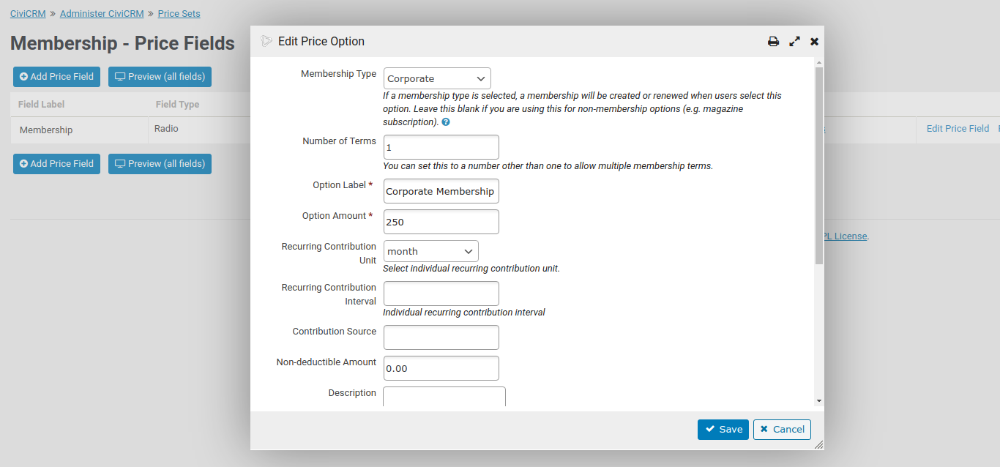

# CiviCRM Priceset Frequency (au.com.agileware.pricesetfrequency)

This is a [CiviCRM](https://civicrm.org) extension that enables a single Contribution page to have options for multiple recurring Contributions, each with different recurring payment schedules (frequency).
Such that you can provide donation frequency options or membership renewal of daily, weekly, monthly or yearly with varying intervals.
This is implemented by adding two new fields to each **Priceset Option** within a **Priceset**:

* **Recurring Contribution Unit**: Which determines if this option should generate a recurring Contribution. Options: no recurrence, day, week, month, year  
* **Recurring Contribution Interval**: Which determines the interval of the recurrence. Integer field.

When the Contribution page is processed, each Priceset Option with a defined **Recurring Contribution Unit** will result in the creation of a recurring Contribution according to the options selected. 

The screenshot above displays the **Recurring Contribution Unit** and **Recurring Contribution Interval** fields for a Membership Priceset.

Using this extension you can now implement a single Donation page with multiple recurring payment options, such as:

* Donate $1 per day
* Donate $5 per week
* Donate $30 per month
* Donate $300 per year

When using this with Membership payments it is important that the Membership Type has the same Recurring terms as you wish to have on the contribution page. So for example, if you wanted to make 12 monthly payments for a memberhsip you would:

* Set the Membership Type Monthly Terms to 1 month
* Set the corresponding Priceset Option for the matching Membership Type to 12 **Number of Terms** (since you want the payment to happen 12 times)
* Set the corresponding Priceset Option for the matching Membershipt Type to 1 **Recurring Contribution Interval** (since you want the payment to happen each month)

## Sponsorship

Development of this CiviCRM extension was kindly sponsored by [Australian Greens](https://greens.org.au).

 

## About the Authors

CiviCRM Priceset Frequency was developed by the team at [Agileware](https://agileware.com.au).

[Agileware](https://agileware.com.au) provide a range of CiviCRM services including:

  * CiviCRM migration
  * CiviCRM integration
  * CiviCRM extension development
  * CiviCRM support
  * CiviCRM hosting
  * CiviCRM remote training services
  * And of course, CiviContact development and support

Support your Australian [CiviCRM](https://civicrm.org) developers, [contact Agileware](https://agileware.com.au/contact) today!

