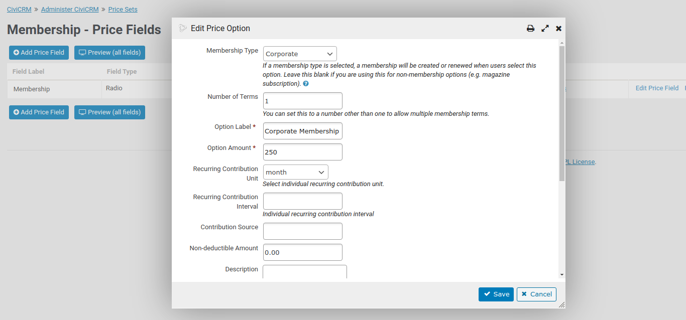

# Priceset Frequency (au.com.agileware.pricesetfrequency)

This is a [CiviCRM](https://civicrm.org) extension that enables a single Contribution page to have options for multiple recurring Contributions, each with different recurring payment schedules (frequency).
Such that you can provide donation frequency options or membership renewal of daily, weekly, monthly or yearly with varying intervals.
This is implemented by adding two new fields to each **Priceset Option** within a **Priceset**:

* **Recurring Contribution Unit**: Which determines if this option should generate a recurring Contribution. Options: no recurrence, day, week, month, year  
* **Recurring Contribution Interval**: Which determines the interval of the recurrence. Integer field.

When the Contribution page is processed, each Priceset Option with a defined **Recurring Contribution Unit** will result in the creation of a recurring Contribution according to the options selected. 

The screenshot above displays the **Recurring Contribution Unit** and **Recurring Contribution Interval** fields for a Membership Priceset.

Using this extension you can now implement a single Donation page with multiple recurring payment options, such as:

* Donate $1 per day
* Donate $5 per week
* Donate $30 per month
* Donate $300 per year

When using this with Membership payments it is important that the Membership Type has the same Recurring terms as you wish to have on the contribution page. So for example, if you wanted to make 12 monthly payments for a memberhsip you would:

* Set the Membership Type Monthly Terms to 1 month
* Set the corresponding Priceset Option for the matching Membership Type to 12 **Number of Terms** (since you want the payment to happen 12 times)
* Set the corresponding Priceset Option for the matching Membershipt Type to 1 **Recurring Contribution Interval** (since you want the payment to happen each month)

The extension is licensed under [AGPL-3.0](LICENSE.txt).

## Usage

### Configuring a Price Set with recurring options

On the **Administer > CiviContribute > Manage Price Sets** edit forms, this extension adds the following
fields wherever a Price Field or Price Field Option (Price Field Value) can be edited:

* **Recurring Contribution Unit** - `No recurrence`, `day`, `week`, `month` or `year`. Leave as *No
  recurrence* for a normal, one-off amount.
* **Recurring Contribution Interval** - the number of units between each payment (e.g. `3` with a unit
  of `month` gives quarterly payments).
* **Contribution Source** - an optional value recorded as the `Contribution Source` on the Contribution(s)
  generated from this option.

These fields are available on the Price Field form (for a single amount/Text field) and on the Price Field
Option form (for radio/select/checkbox style price fields), so different options within the same Price Set
can each have their own frequency, or no recurrence at all.

### Contribution page behaviour

* On the **Contribution Page > Amounts** configuration tab, selecting a Price Set that already contains an
  option with a recurring frequency automatically disables the standard CiviCRM recurring contribution
  block for that page (frequency is instead controlled per Priceset Option).
* On the public-facing contribution form, each priceset option's label is annotated with its schedule, e.g.
  *"Donate $30 per month (Contribute every 1 month)"*.
* If any selected option has a recurring frequency, the contributor is required to confirm recurring
  billing; if none do, they are asked to leave that confirmation unchecked. If a selected option is linked
  to an auto-renewing Membership Type, the contributor is also required to confirm membership auto-renewal.

### Contribution processing

When a Contribution from one of these Price Sets is completed, the extension automatically splits the
single Contribution into one Contribution per distinct payment schedule found in its line items (grouping
one-off items together, and grouping recurring items by matching unit/interval). For each recurring group it
creates or updates a Recurring Contribution record with the correct frequency, links any Membership line
items to that Recurring Contribution for auto-renewal, and sends the confirmation/receipt email once for the
overall transaction rather than once per generated Contribution.

### API

This extension exposes a `PricesetIndividualContribution` API (v3) entity with `get`, `create` and `delete`
actions. It stores the Recurring Contribution Unit, Recurring Contribution Interval and Contribution Source
against a given Price Field / Price Field Value combination, and is primarily used internally by the
extension, but is available for reporting or integration purposes.

## Special configuration requirements

No credentials, API keys, or settings pages are required to use this extension; the recurring schedule is
configured directly on each Price Set Option as described above. The user configuring Price Sets needs the
standard CiviCRM permissions to administer Price Sets/Contribution Pages.

When using this extension for Membership renewals, ensure the Membership Type's own renewal terms match
the schedule you configure on the corresponding Priceset Option, per the example above, otherwise the
Membership's renewal date and the recurring payment schedule will not stay in sync.

## Requirements

* CiviCRM 5.70+

## Installation (Web UI)

Learn more about installing CiviCRM extensions in the [CiviCRM Sysadmin
Guide](https://docs.civicrm.org/sysadmin/en/latest/customize/extensions/).

## Sponsorship

Development of this CiviCRM extension was kindly sponsored by [Australian Greens](https://greens.org.au).

 

## About the Authors

CiviCRM Priceset Frequency was developed by the team at [Agileware](https://agileware.com.au).

[Agileware](https://agileware.com.au) provide a range of CiviCRM services including:

  * CiviCRM migration
  * CiviCRM integration
  * CiviCRM extension development
  * CiviCRM support
  * CiviCRM hosting
  * CiviCRM remote training services
  * And of course, CiviContact development and support

Support your Australian [CiviCRM](https://civicrm.org) developers, [contact Agileware](https://agileware.com.au/contact) today!

